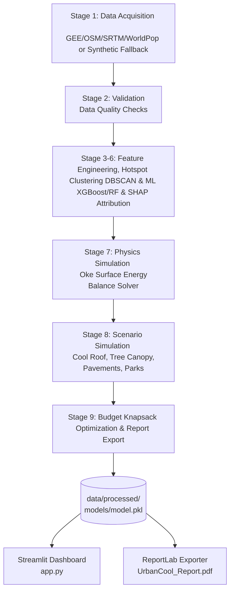

# UrbanCool AI — Centralized Geospatial UHI Mitigation System

UrbanCool AI is a complete, full-stack, offline-ready, geospatial AI/ML and thermodynamic modeling system designed to detect, analyze, and mitigate the **Urban Heat Island (UHI)** effect in Indore, Madhya Pradesh, India. 

The system enables municipal authorities and urban planners to:
1. Identify severe heat stress hotspots from satellite and morphology data.
2. Attribute local temperature anomalies to key morphology drivers using machine learning (XGBoost + SHAP).
3. Validate predictions against physical energy conservation laws using an Urban Surface Energy Balance (USEB) solver.
4. Simulate the cooling impact of microclimate interventions (cool roofs, tree planting, reflective pavement, urban parks).
5. Optimize capital allocation under a budget constraint using integer linear programming (PuLP) and greedy knapsack algorithms.
6. Interact with findings through a dynamic Streamlit web dashboard and export high-resolution ReportLab PDF summaries.

---

## 🗺️ Architecture & Workflow

The pipeline is fully automated and modular, running in 9 distinct sequential stages:



---

## 🚀 Environment Setup

UrbanCool AI is built with offline capability and hardened geospatial dependencies.

### System Prerequisites
Depending on your OS, native C-libraries like GDAL and PROJ are required:
- **Windows**: Standard binary dependencies are pre-compiled and packaged inside the wheel distributions.
- **macOS**: Install via Homebrew: `brew install gdal proj`
- **Linux (Ubuntu/Debian)**: Install via apt: 
  ```bash
  sudo apt-get update && sudo apt-get install -y python3-dev gdal-bin libgdal-dev proj-bin libproj-dev
  ```

### Installer Scripts
Run the appropriate automated script to create a virtual environment, install pinned dependencies, and perform verification:

- **Windows PowerShell**:
  ```powershell
  .\setup.ps1
  ```
- **Windows Command Prompt**:
  ```cmd
  setup.bat
  ```
- **macOS / Linux Bash**:
  ```bash
  chmod +x setup.sh
  ./setup.sh
  ```

To manually run verification checks at any time:
```bash
python verify_setup.py
```

---

## 📦 Centralized Configuration

Centralized parameters are declared as uppercase constants in `src/config.py`:
* `RANDOM_SEED = 42`: Ensures identical synthetic data, cross-validation splits, and clustering results.
* `FORCE_OFFLINE_MODE = True`: Bypasses external network queries to run entirely locally using synthetic raster/vector generators.
* `MAX_GRID_SIZE = 100`: Resolution cell count for Indore.
* `MODEL_PATH`: Cache path for the trained model pickle (`models/model.pkl`).
* `CACHE_PATH`: Cache path for processed datasets.
* `EXPORT_PATH`: Output path for the exported PDF report (`outputs/UrbanCool_Report.pdf`).
* `HOTSPOT_PERCENTILE = 90`: Cut-off percentile for anomaly fallback.
* `API_TIMEOUT = 30`: Timeout threshold in seconds for real API downloads.

---

## 🛠️ Execution & Deployment

### 1. Precompute the Analysis Pipeline
Execute the full preprocessing, data validation, machine learning, physics-informed calculations, budget optimization, and report rendering pipeline:
```bash
python run_pipeline.py
```
This writes the cached outputs to `data/processed/`, `models/`, and `outputs/`.

### 2. Launch the Streamlit Dashboard
Run the interactive application:
```bash
streamlit run dashboard/app.py
```
Navigate in the sidebar between the 6 distinct pages:
1. **1. City Overview**: Indore LST summaries, metrics, and severe hotspots table.
2. **2. Hotspot Map**: Interactive Folium map highlighting DBSCAN hot clusters and population exposure.
3. **3. Driver Analysis**: SHAP importance bar charts (global and cluster-specific).
4. **4. Intervention Simulator**: Slide to change tree planting, cool roofs, or reflective pavement cover. Re-computes surface temperatures in real-time.
5. **5. Budget Optimizer**: Choose a budget constraint (INR) and select the optimal portfolio. Click the **Generate & Export PDF Report** to render a clean ReportLab PDF document.
6. **6. Transparency Panel**: Evaluates cross-validation $R^2$, RMSE, and MAE alongside the Oke Surface Energy Balance equations and assumed cost constants.

---

## 🧪 Testing Suite

Run the automated test suites to verify system validity:

### Thermodynamics Unit Tests
Run pytest to check that the energy balance solver converges correctly and aligns with thermodynamic laws (e.g. higher albedo reduces surface temperature):
```bash
python -m pytest tests/test_physics_model.py
```

### End-to-End Smoke Test
Run the comprehensive integration test to validate that pipeline output structures, value ranges (LST, NDVI), SHAP attributions, non-empty optimizations, and report configurations are fully validated:
```bash
python -m tests.test_end_to_end
```

---

## 🔍 Troubleshooting

* **ModuleNotFoundError: No module named 'src'**:
  When running scripts directly, Python may fail to find local package folders. Always run integration tests or scripts from the repository root directory using the module flag (e.g. `python -m tests.test_end_to_end` instead of `python tests/test_end_to_end.py`).
* **PermissionError: [Errno 13] Permission denied**:
  On Windows systems, files may be briefly locked during high-throughput IO. The pipeline has built-in retry-backoff logic for writing geospatial outputs to bypass this.
* **Low ML Validation $R^2$ Warning**:
  Due to the random noise field of the synthetic generator, the XGBoost validation $R^2$ may fall below `0.30`. The system will log a warning as required and proceed with execution gracefully.