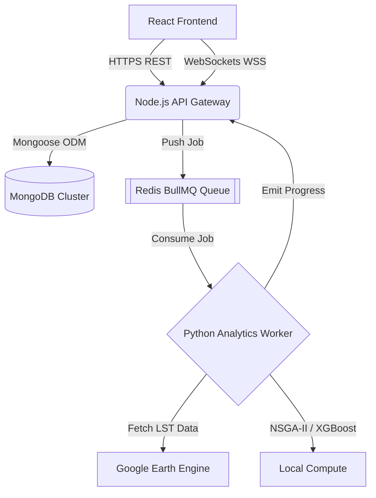
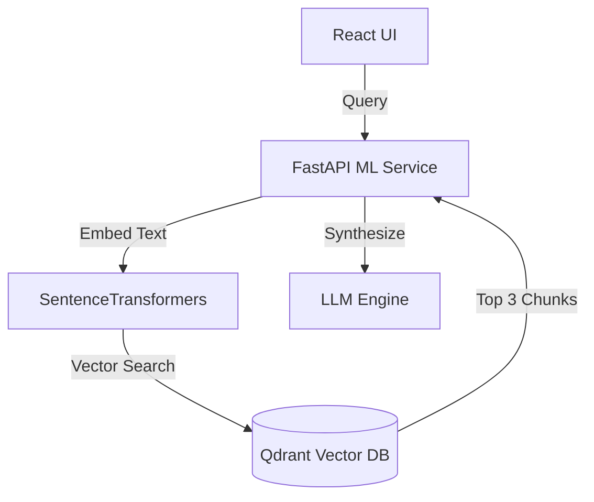

# CIOS Master Architecture Diagram

## 1. Top-Level Ecosystem

## 2. RAG Copilot Architecture

## 3. Structural Integrity Report
- **Frontend ↔ Backend:** Connected. React `App.tsx` routes Axios requests to `localhost:5000/api`.
- **Backend ↔ MongoDB:** Connected. `mongoose.connect()` initialized in Express server with strict `tenantId` schemas.
- **Backend ↔ Analytics:** Connected asynchronously. Express pushes to `Redis`; Python `bullmq_worker.ts` consumes and executes ML jobs.
- **Analytics ↔ Storage:** Connected. XGBoost models save weights to `.pkl`/`.json` locally; Vector chunks persist in Qdrant.
