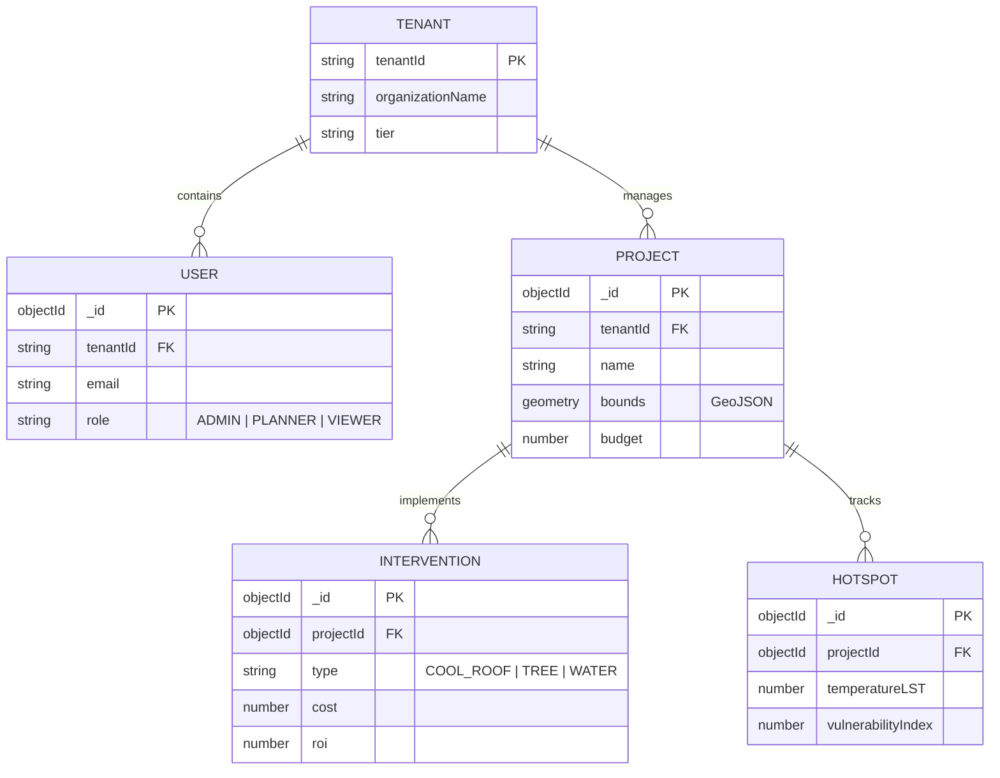
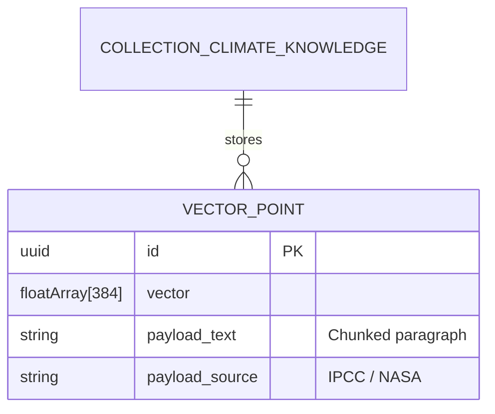

# CIOS Database Entity-Relationship (ER) Schema

## 1. MongoDB Document Store (Relational Simulation)

```mermaid
erDiagram
    TENANT ||--o{ USER : contains
    TENANT ||--o{ PROJECT : manages
    PROJECT ||--o{ INTERVENTION : implements
    PROJECT ||--o{ HOTSPOT : tracks

    TENANT {
        string tenantId PK
        string organizationName
        string tier
    }

    USER {
        objectId _id PK
        string tenantId FK
        string email
        string role "ADMIN | PLANNER | VIEWER"
    }

    PROJECT {
        objectId _id PK
        string tenantId FK
        string name
        geometry bounds "GeoJSON"
        number budget
    }

    HOTSPOT {
        objectId _id PK
        objectId projectId FK
        number temperatureLST
        number vulnerabilityIndex
    }

    INTERVENTION {
        objectId _id PK
        objectId projectId FK
        string type "COOL_ROOF | TREE | WATER"
        number cost
        number roi
    }
```

## 2. Qdrant Vector Store

```mermaid
erDiagram
    COLLECTION_CLIMATE_KNOWLEDGE ||--o{ VECTOR_POINT : stores

    VECTOR_POINT {
        uuid id PK
        floatArray[384] vector
        string payload_text "Chunked paragraph"
        string payload_source "IPCC / NASA"
    }
```
