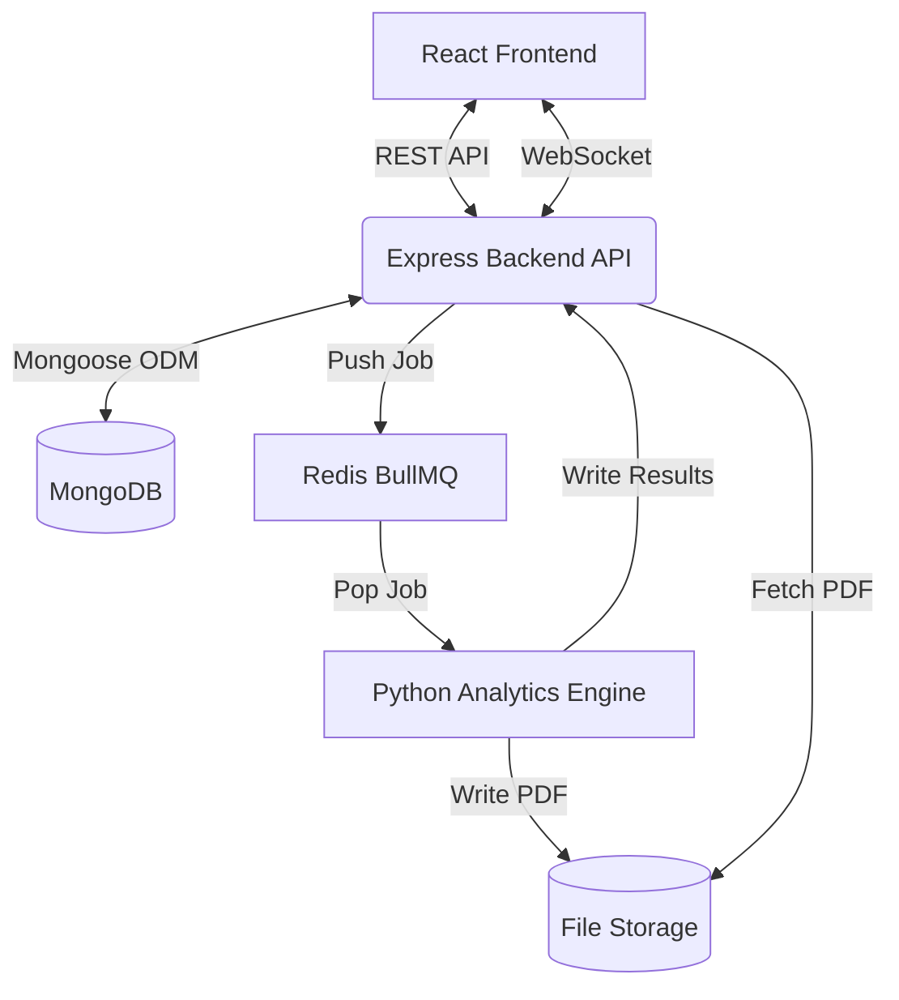

# UrbanOS Service Diagram

```mermaid
graph TD
    A[React Frontend] <-->|REST API| B(Express Backend API)
    A <-->|WebSocket| B
    B <-->|Mongoose ODM| C[(MongoDB)]
    B -->|Push Job| D[Redis BullMQ]
    D -->|Pop Job| E[Python Analytics Engine]
    E -->|Write Results| B
    E -->|Write PDF| F[(File Storage)]
    B -->|Fetch PDF| F
```
